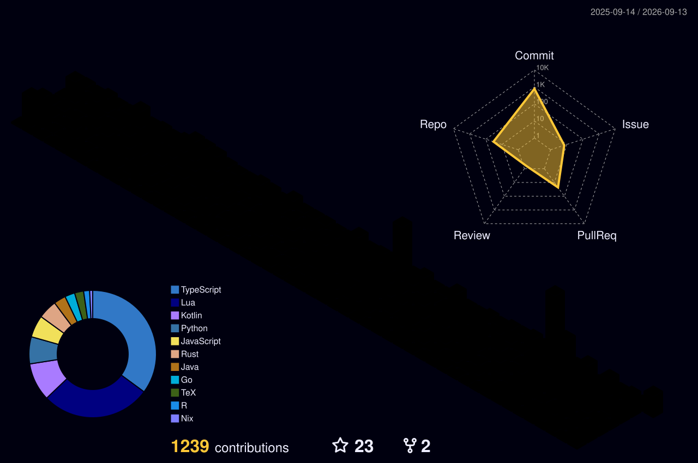

# Hi, I'm Eurekaimer

Lifelong learning &middot; quiet exploration &middot; building things with care

 

最推しキャラクター: 小鞠知花（『負けヒロインが多すぎる！』）

| Category | Badges |
| :---: | :---: |
| **OS** |   |
| **Desktop** |   |
| **Languages** |     |
| **Tools** |         |
| **IDE** |   |
| **VM** |     |
| **Compatibility** |    |
| **Research** |    |
| **Reader** |    |
| **AI** |   |
| **Agent** |     |
| **Games** |    |
| **Miracle** |       |

## About Me

I enjoy lifelong learning, probability theory, and computational experiments that turn abstract ideas into something visible and testable.

I use NixOS as my daily system and like building reproducible development environments with Docker. Python is my main language, and I also enjoy C, distributed computing, and exploring unfamiliar ideas.

Outside code and math, I enjoy Slay the Spire, Touhou Project's Hifuu Club, Chika Komari, and yuri works with gentle, thoughtful stories.

## Contributions

<picture>
  <source media="(prefers-color-scheme: dark)" srcset="https://raw.githubusercontent.com/Eurekaimer/Eurekaimer/output/github-contribution-grid-snake-dark.svg">
  <source media="(prefers-color-scheme: light)" srcset="https://raw.githubusercontent.com/Eurekaimer/Eurekaimer/output/github-contribution-grid-snake.svg">
  
</picture>

 

<em>feel free to reach out to me</em>

